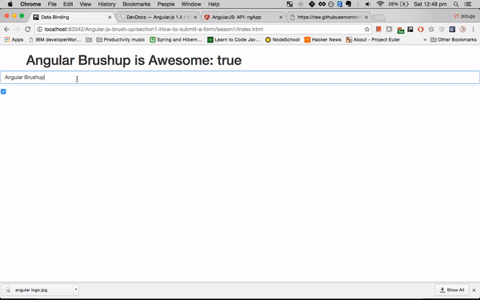

#Angular js Course From Codecraft

## Section 1 - How to submit and validate a form in AngularJS

### Folders

./libs/ - The required libraries for all lessons.

- [x] #### lesson1 - Data Binding.

- [x] #### lesson2 - Controllers and Modules.
- [x] #### lesson3 - Submit a form using $http.
- [x] #### lesson4 - Form Validation using HTML5.
- [x] #### lesson5 - Form Validation using core Angular js.
- [x] #### lesson6 - Form Validation using Angular Auto Validate.
- [x] #### lesson7 - User Feedback with Ladda buttons.

completed - The completed application for this section
